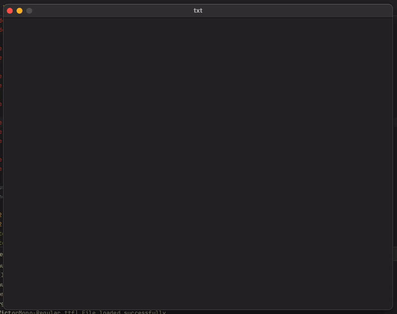

# funk-txt

`funk-txt` is a minimal text editor built using Raylib in C. It displays and edits text files in a custom font, with a blinking cursor and dynamic text resizing.



## Features

- Open and edit text files (`.txt`).
- Dynamic text scaling based on length.
- Keyboard support:
  - **Backspace**: Delete text.
  - **Enter**: Add a new line.
  - **Tab**: Add spaces.
  - **Ctrl + S**: Save file.
  - **Ctrl + X**: Clear text.

## Usage

1. **Run the program**:
   ```bash
   ./funk-txt [filename]
   ```
   If no filename is provided, it defaults to `txt`.

2. **Edit and save your text file**.

## Requirements

- Raylib library installed.
- A C compiler like GCC.

